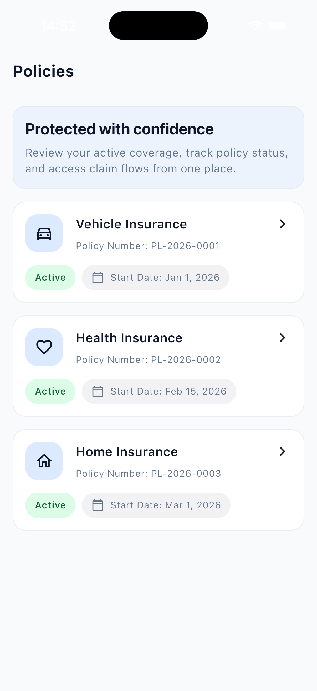
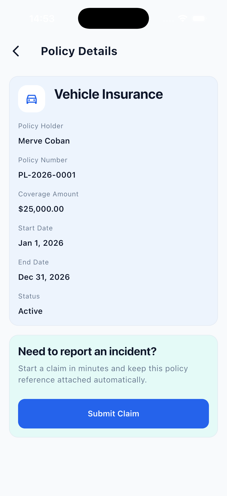
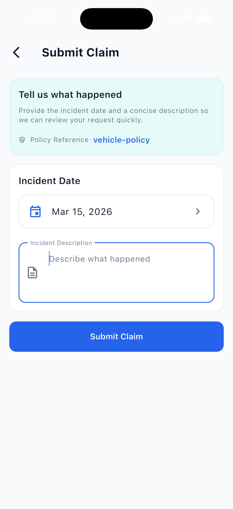
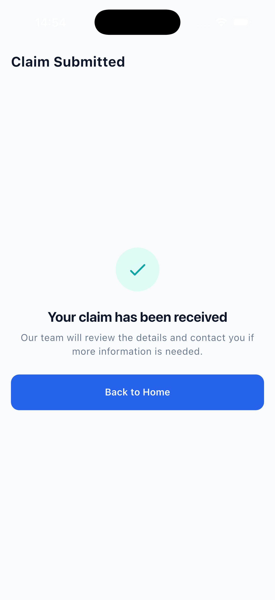

# Insurance Mobile App

A Flutter MVP demonstrating an insurance policy management and claim submission flow.

The application allows users to:

- view active insurance policies
- inspect policy details
- submit a claim for a specific policy

The application is being built around a clean, scalable architecture with a strong focus on separation of concerns, predictable state management, and maintainable feature boundaries.

## Requirements

- Flutter SDK 3.x (Dart ^3.10.7)

## Tech Stack

- Flutter
- Riverpod
- GoRouter
- Dio
- Feature-first folder structure
- Clean Architecture principles

## Architectural Approach

This project follows a `feature-first + clean architecture` structure.

Each feature is organized into four layers:

- `presentation`: screens, widgets, and Riverpod UI state/controllers
- `domain`: entities, repository contracts, and use cases
- `data`: models, datasources, and repository implementations
- `di`: feature-level dependency composition

Shared application concerns are kept outside features:

- `app`: application shell, concrete router setup, theme assembly, and app-level setup
- `core`: infrastructure and cross-cutting non-UI primitives such as config, networking, logging, error mapping, low-level types, and result handling
- `di`: app-wide Riverpod dependency composition for shared services like config, logging, and networking
- `navigation`: shared route contracts and location builders used by both the app shell and feature UI
- `shared`: cross-feature UI building blocks such as widgets, layout helpers, design primitives, and UI-only extensions; keep it presentational and free of feature-specific business logic

## Folder Boundaries

Use these rules to decide where code belongs:

- Put app shell concerns in `lib/app`: concrete `GoRouter` setup, theme assembly, and other composition-level UI configuration.
- Put infrastructure and non-UI cross-cutting code in `lib/core`: config, networking, logging, exceptions, failures, result wrappers, and low-level shared types like `JsonMap`.
- Put shared route contracts and location builders in `lib/navigation`; features can depend on these contracts, but not on `lib/app/router`.
- Put reusable presentational Flutter code in `lib/shared`: common widgets, responsive/layout helpers, design primitives, and UI extensions such as `BuildContext` helpers.
- Keep feature logic inside `lib/features/*` with `presentation`, `domain`, `data`, and `di`.
- Avoid generic dumping-ground folders. Create intent-revealing names like `types`, `network`, `error`, or `extensions` instead of broad `utils` and `constants` buckets when possible.
- Keep reusable UI-specific constants out of `core`; place theme assembly in `app/theme` and shared design tokens in `shared/design`.

## Riverpod Conventions

- UI state lives under `features/*/presentation/providers`
- Feature composition lives under `features/*/di`
- Shared providers live under `lib/di`; keep Riverpod providers out of `core`
- Features may depend on `core`, `shared`, and `navigation`; they should not import `app`
- Use `package:insurance_mobile/...` imports for internal source files
- Keep `shared` limited to reusable presentational widgets, layout helpers, design primitives, and generic components
- Screens stay thin and react to provider state
- Datasources throw `AppException`
- Repositories map `AppException` to `Failure`

## Routing

Routing is handled with `GoRouter`.

Current route structure:

- `/policies`
- `/policies/:policyId`
- `/claims/new/:policyId`
- `/claims/success`

## Localization

The app uses Flutter's built-in l10n with ARB files. All visible text is localized.

- **Source**: `lib/l10n/` — ARB template `app_en.arb`, generated `AppLocalizations`
- **Config**: `l10n.yaml` — output class `AppLocalizations`, nullable getters disabled
- **Supported locales**: English (`en`)
- **Usage**: `AppLocalizations.of(context)` for lookups; `localizationsDelegates` and `supportedLocales` wired in `MaterialApp.router`

To add a new locale, create `app_<locale>.arb` in `lib/l10n/` and run `flutter gen-l10n`.

## Current Project Status

The MVP case study flow is implemented end to end with mocked network responses in
development.

Implemented so far:

- app bootstrap with `ProviderScope`
- centralized router setup
- feature module wiring for `policy` and `claim`
- mock async policy fetching
- mock claim submission flow
- policy list, detail, and claim submission screens
- loading, success, empty, and error states

## Screenshots

| Policies | Policy Details | Submit Claim | Claim Submitted |
|----------|----------------|--------------|-----------------|
|  |  |  |  |

## Project Structure

```text
lib/
  app/
    router/
    theme/
  navigation/
  core/
    config/
    error/
    logging/
    network/
    result/
    types/
  di/
  shared/
    design/
    extensions/
    layout/
    widgets/
  features/
    policy/
      data/
      domain/
      presentation/
      di/
    claim/
      data/
      domain/
      presentation/
      di/
```

## Getting Started

```bash
flutter pub get
flutter run
```

By default the app uses the `dev` environment, which keeps networking in mock mode
inside the datasource layer. To switch environments:

```bash
flutter run --dart-define=APP_ENV=dev
flutter run --dart-define=APP_ENV=prod
```

`dev` uses mocked async responses for the case study MVP, while `prod` is prepared
to call real Dio endpoints with the configured base URL.

To validate the codebase:

```bash
flutter analyze
flutter test
```
